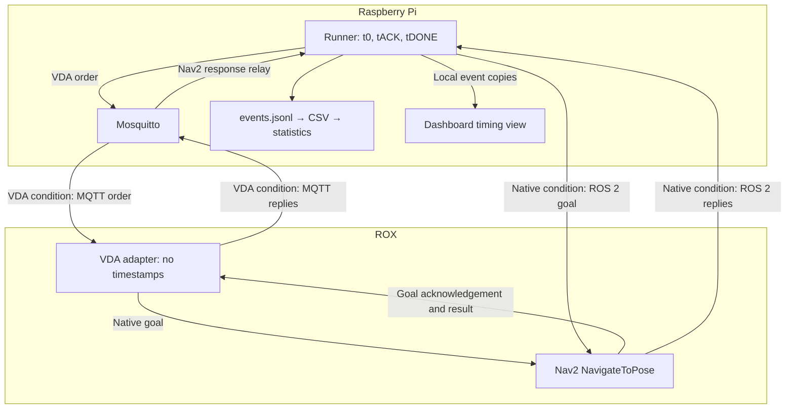

# Architecture and measurement boundary

## Normal operation

The Pi runs Mosquitto and the master/dashboard. ROX runs ROS 2, Nav2 and the
VDA adapter. The crane PLC exposes OPC UA; its adapter and watchdog run on the
Pi. Local controllers and physical safety systems remain responsible for motion.

## Paper benchmark

The dedicated Pi runner replaces the master as the command origin during a
trial. Keep the master idle. It may display the runner's events. No benchmark
runner, logger, clock service or measurement file is needed on ROX.

Only one command path is used per trial. Both originate on the Pi, use the
same target x/y/heading, and terminate at the same Nav2 action server. The
VDA order contains a start node, one edge and a target node. The already-reached
start node does not create an additional Nav2 goal.

## Three timing events, one clock

| Symbol/event | Exact boundary | Captured by |
|---|---|---|
| t0 / `COMMAND_ISSUED` | After target/message preparation and validation, just before command submission | Pi runner |
| tACK / `NAV2_ACK_RECEIVED` | Entry to the callback receiving the corresponding Nav2 goal response | Pi runner |
| tDONE / `NAV2_RESULT_RECEIVED` | Entry to the callback receiving the corresponding terminal Nav2 result | Pi runner |

The native callbacks receive ROS 2 action responses. In the VDA condition, the
ROX adapter receives those same kinds of responses and immediately publishes
small notifications over MQTT. The receiving Pi callback records the time
before decoding the payload. Notifications contain order/node IDs, the native
goal UUID, accepted/rejected state or terminal status, and no timestamp.

The notifications use the experiment topic
`vda5050/benchmark/nav2/<manufacturer>/<serial>` and protocol `pi-nav2-v1`.
They are **experimental feedback**, not standard VDA order acknowledgements.
Standard VDA `state` continues unchanged. The 2 Hz state timer is not used to
infer the benchmark's Nav2 acceptance or completion. Feedback QoS is 1 with
retain disabled; command QoS remains the deployed adapter's 0. Duplicate
feedback is ignored after correlation; conflicting feedback fails the trial.

Both durations use the Pi's `time.monotonic_ns()`:

\[
L_{ack}=(t_{ACK}-t_0)/10^6\quad\text{ms}
\]
\[
T_{completion}=(t_{DONE}-t_0)/10^6\quad\text{ms}
\]

No clock synchronization or cross-computer subtraction is used. ROS goal
timestamps are zero in both benchmark paths to request the latest transform;
ROS header time is not an experimental duration clock.

`TRIAL_FINISHED` records a later endpoint/stationarity check or a failure.
Its timestamp does not enter the two metrics. Final pose is checked through
localization and odometry received by the Pi, not external metrology.

## Interpretation for the paper

The paired effect is VDA minus native response time for an identical movement.
It includes command transport, adapter processing, and the chosen response
path. It does not isolate one-way network latency, broker time, adapter CPU
time, or physical motion duration. Completion time includes the rotation and
delivery of the terminal result. Nav2 success is a controller report; endpoint
verification supplies an additional functional check.

This comparison removes the old, artificial ROX-runner → Pi-broker journey.
It measures the Pi-origin command path relevant to a central controller, while
excluding the Flask HTTP/UI and master scenario scheduling overhead. These
boundaries must accompany reported numbers. Do not describe this as measuring
the performance of every possible VDA implementation.
